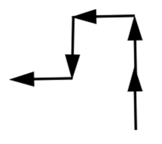

# 5. Robot

&emsp;Sokféle tevékenységet végeznek a környezetünkben az automaták, illetve a robotok.

&emsp;Egy egyszerű robot a végrehajtandó mozgását egy betűkből álló sorozattal, szóval kapja. Vízszintes síkban szabadon mozog, iránytűje segítségével pontosan be tudja tájolni magát. Az `E`, `D`, `K` vagy `N` betűk hatására egységnyit megy észak, dél, kelet vagy nyugat felé.

Például, ha a robot által kapott szó: `EENDN`, akkor a robot útvonala:

<p align="center">
  
</p>

&emsp;Készítsen programot, amely a parancsszót, azaz a betűk sorozatát egyszerűsíti, vagyis olyan új parancsszót állít elő, amelynek végrehajtásakor a robotot a kezdőpontból a végpontba a lehető legkevesebb utasítással juttatja el! A parancsszavak hossza legfeljebb 200 betű.

|              | Parancsszó | Új parancsszó |
| -----------: | ---------- | ------------- |
| **1. példa** | ENEK       | EE            |
| **2. példa** | EENDN      | ENN vagy NNE  |
| **3. példa** | EEKDKDNN   |               |

&emsp;A program forráskódját mentse `robot` néven! A program megírásakor a felhasználó által megadott adatok helyességét, érvényességét nem kell ellenőriznie, és feltételezheti, hogy a rendelkezésre álló adatok a leírtaknak megfelelnek. Ha a robot kezdőpontja és mozgásának végpontja azonos, akkor az új parancsszó üres.

&emsp;A képernyőre írást igénylő részfeladatok esetén az ékezetmentes kiírás is elfogadott.

1. Olvassa be és tárolja el a robot mozgását vezérlő szót, és annak felhasználásával oldja meg a következő feladatokat

2. Írja ki, hogy az egyes betűkből hány darab van a szóban!

3. Írja ki a képernyőre a bekért útvonal egy lehetséges egyszerűsítését, tehát egy olyan új parancsszót, amelyet végrehajtva a robot a lehető legkevesebb mozgással juthat el a kiindulási pontból az eredeti parancsszónak megfelelő végső helyzetbe!

**Minta a szöveges kimenet kialakításához:**

```
Kérem a robot parancsait: EEEKDKEKDKEKDDNN
E betűk száma: 5
D betűk száma: 4
K betűk száma: 5
N betűk száma: 2
Egy legrövidebb út parancsszava: KKKE
```
